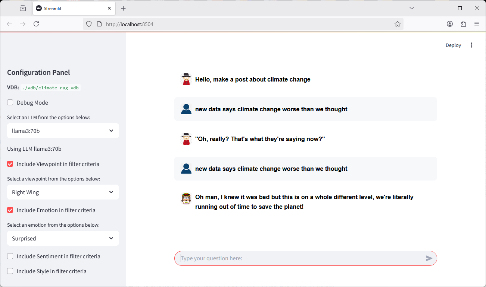

# ENVIRO_BOT
Source code for Simulating Human Responses to Environmental Messaging

Here is the source code pertaining to the paper
Simulating Human Responses to Environmental Messaging
by Dr Ian Drumm1, Dr Atefeh Tate2, The University of Salford, UK 

This work is part of an ongoing project to develop and evaluate virtual humans whose responses to environmental messaging are shaped by their media exposure and social interactions. The project involved scraping thousands of Reddit post/comment pairs related to environmental topics. These were then classified by viewpoint, sentiment, emotion, and other features, and stored in a vector database alongside embedded representations and associated metadata.

Using this setup, we leveraged local large language models with retrieval-augmented generation (RAG) to create chatbots that respond to new Reddit posts with comments reflecting stereotypical attitudes. The classification metadata allowed for fine-grained filtering of the vector database to simulate different personas during response generation.

The applications here are ..

**enviro_bot_agent.py**     # command line app to create vector database by scraping reddit posts, test with command line chat, run evaluation metrics 

**enviro_bot_chat.py**           # browser app where you type a Reddit style post (choose from viewpoints and sentiments), to recieve AI simulated comment

## Example Basic Usage:

### Create a vector database from Reddit posts, assuming you have create a sub direcory ./vdb

**python enviro_bot_agents.py create --search="gas prices" --vdb="./vdb/my_gas_vdb"**

### Chat with the vector database

**streamlit run enviro_bot_chat.py -- --vdb="./vdb/my_gas_vdb"**

## Setup:
Note this application was developed with Ubuntu on a high performance computer 
2× AMD EPYC 7702 CPUs (128 cores, 256 threads total) and 7× NVIDIA A100 PCIe 80GB GPUs.
Similar performance may be required for database creation with classification, and batch evaluation.

For basic inference you will need at least the ability to run models such as LLama3:70B.

Download and install ollama.com
ollama pull llama3:70b
ollama pull mistral-nemo

Create a python virtual env
conda create --name enviro_bot_env python=3.10
conda activate enviro_bot_env
pip install -r requirements.txt

You will need a Reddit account and create a .env file in the main project directory, with the contents...

REDDIT_CLIENT_ID=***************************

REDDIT_CLIENT_SECRET=***************************

REDDIT_USERNAME=***************************

REDDIT_PASSWORD=***************************

##Advanced Usage:

### Evaluation metrics generation

&nbsp;&nbsp;&nbsp;&nbsp;**python enviro_bot_agents.py evaluate --vdb="./vdb/my_gas_vdb" --out_file="gas_eval" --samples=10**

### Pull from the database into an excel file

&nbsp;&nbsp;&nbsp;&nbsp;**python enviro_bot_agents.py pull --vdb="./vdb/my_gas_vdb"**

### Chat to vector database  from command line with new dummy posts based on a class and classification
### Though recommended to use enviro_bot_chat.py instead.

**python enviro_bot_agents.py chat --vdb="./vdb/my_gas_vdb" --my_class="Viewpoint" --classification="Left Wing"**

## Licensing

The Python code authored for this project (e.g., `enviro_bot_chat.py`,  `enviro_bot_agents.py`, `enviro_bot_analyzer.py` and custom modules under `tools/`) is dedicated to the public domain. You can find the full dedication in the LICENSE file (e.g., CC0 1.0 Universal or The Unlicense).

### Dependencies

This project relies on several third-party libraries and tools, each governed by its own license. Key dependencies include:

*   Streamlit (Apache License 2.0)
*   Langchain (MIT License)
*   Ollama (MIT License)
*   ChromaDB (Apache License 2.0)
*   Pandas (BSD 3-Clause License)
*   Plotly (MIT License)
*   Various LLM Python client libraries (typically MIT or Apache 2.0)

Users are responsible for complying with the licenses of all dependencies.

### Large Language Model (LLM) Usage

This software can be configured to use various Large Language Models (LLMs) through services like Ollama or direct API calls (e.g., OpenAI).

**Important:** The LLMs themselves are subject to their own licenses or terms of use, which are separate from this project's license. Users are solely responsible for:
1.  Obtaining access to the desired LLMs.
2.  Complying with all terms, conditions, and use restrictions specified by the LLM providers (e.g., Meta for Llama models, Google for Gemma models, OpenAI for GPT models, Mistral AI for Mistral models, etc.).

Please review the license for each LLM you intend to use. Some models, such as Llama 3 and Gemma, have specific license terms that may include use-case restrictions.
